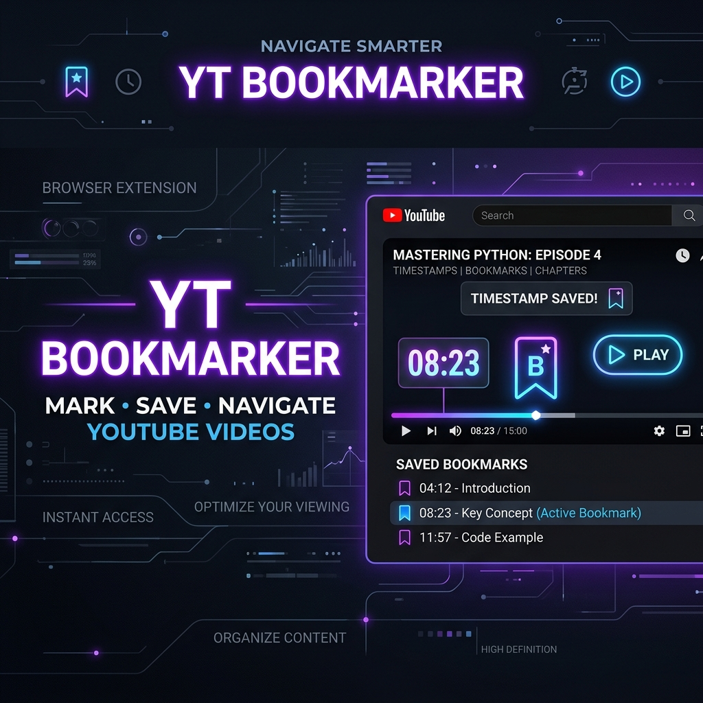

# 🎥 YouTube Bookmarker - Chrome Extension



## 🚀 Overview
**YouTube Bookmarker** is a powerful and lightweight Google Chrome extension designed to enhance your video learning and entertainment experience. It allows you to save specific timestamps (bookmarks) on any YouTube video, making it easy to jump back to important moments later.

Whether you're studying, watching tutorials, or just keeping track of your favorite moments, this extension ensures you never lose your place.

## ✨ Features
- **One-Click Bookmarking**: Quickly save the current timestamp of the video you're watching.
- **Persistent Storage**: Your bookmarks are saved across sessions using Chrome's storage API.
- **Instant Navigation**: Click on any saved bookmark to jump directly to that timestamp in the video.
- **Manage Bookmarks**: View, play, or delete your saved bookmarks with ease from the extension popup.
- **Seamless Integration**: Works directly on the YouTube player interface.

## 🛠️ Tech Stack
- **JavaScript (ES6+)**: Core logic and DOM manipulation.
- **HTML5 & CSS3**: Responsive and clean user interface.
- **Chrome Extension API (MV3)**: Utilizes the latest Manifest V3 standards for background scripts, content scripts, and storage.

## 📦 Installation

### For Developers (Load Unpacked)
1. **Clone the repository**:
   ```bash
   git clone https://github.com/YOUR_USERNAME/youtube-bookmarker-finished-code.git
   ```
2. **Open Chrome Extensions**:
   Navigate to `chrome://extensions/` in your browser.
3. **Enable Developer Mode**:
   Toggle the **Developer mode** switch in the top right corner.
4. **Load Unpacked**:
   Click the **Load unpacked** button and select the `youtube-bookmarker-finished-code` directory.
5. **Start Bookmarking**:
   Open any YouTube video and look for the bookmark icon!

## 📸 Screenshots
*(Coming Soon - Add your own screenshots here!)*

## 📄 License
This project is licensed under the MIT License - see the [LICENSE](LICENSE) file for details.

## 🤝 Contributing
Contributions are welcome! If you have suggestions for new features or improvements, feel free to open an issue or submit a pull request.

---
Developed with ❤️ by [Your Name]
